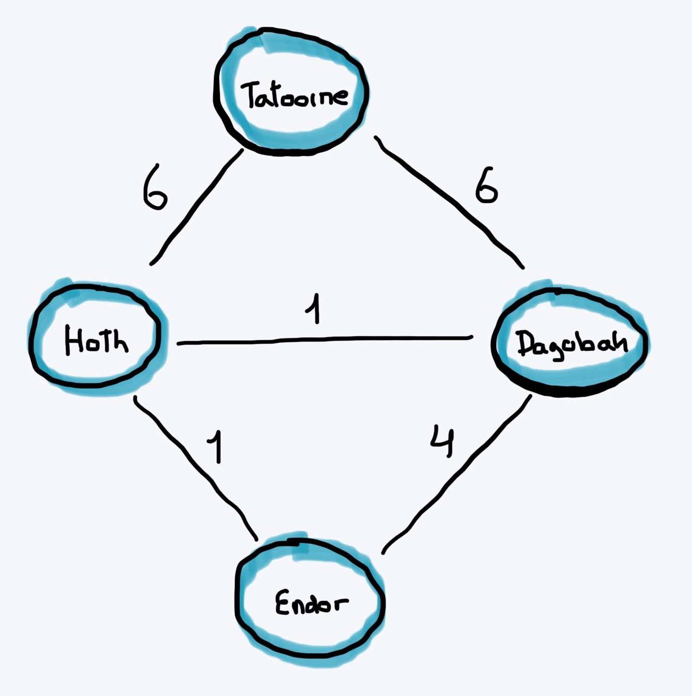
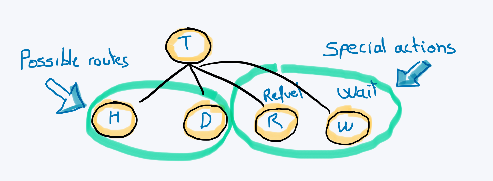
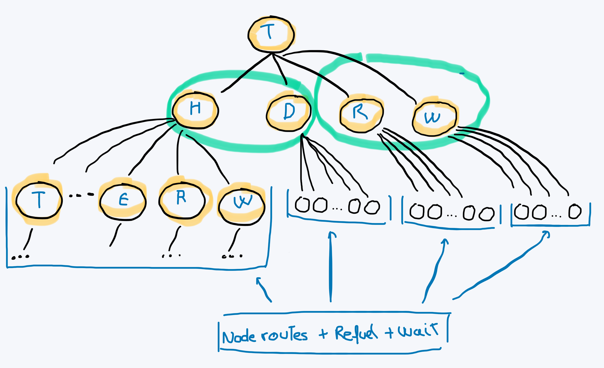
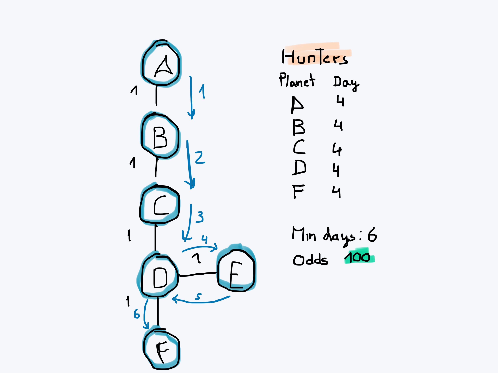

#  Starship Challenge by Marc Benito

This is the solution to "Spaceship travel" challenge coded by Marc Benito in July 2022.
This exercise was done as test aseesment for one company that I preffer to maintain anonymous. I changed all keywords that refers to the company or the given exercices because I don't want people searching for my solution for copying it.

# 1. Route planner algorithm :monocle_face:

Suppose we have the following route graph between planets:



Apart from the routes, we have to consider:
- The need to refuel.
- Bad people avoindance.
- Arrival before the countdown is over.

Giving that constraints, we can conclude:
- The best solution could not be the most fast. Waiting could be the best option in some scenarios.
- Our limit traveling is always set by the countdown of the deathStar. This is important to optimatize the solution.

### Proposal 
For solving the algorithm the idea is to represent **each action as a node** that includes:
- All the possible destination routes from the origin planet (H:Hoth, T: Tatooine, E:Endor, D:Dagobah...)
- The refuel action (R)
- The wait action (W)

For exampe, if we depart from Tatooine (T), we will have the next action representation:

Where the options are:
- Travel to Hoth (H),
- Travel to Dagobah (D),
- Refuel (R),
- Wait (W)
 (Endor (E) is not connected from Tatooine)

With a seccond tralvel action we will have the next graph:


To achieve the solution we have walk the graph and find the best solution.

### BFS Breadth First Search
I decided to use  a __branch and bound__ algorithm based on __breadth-first search__. 
The algorithm cost should be approximately O(n^x) in the worst scenarios, where _n_ is the number of childs (number of planets - 1 + refuel + wait) and _x_ is the countdown of the deathStar.

### Optimizations

The optimizations that I did were:
- On perfect solution (from departure to arrival + time lte countdown + no hunters): stop searching for more.
- On no available fuel: stop searching.
- On no available days: stop searching this branch in depth.
- If the acumulative solution in the actual branch is worse than a previous solution found then: stop that branch.

Some improvements that can be done but depends on the scenarios could be:
- Prioritize not visited  nodes. 
- Prioritize route and refuel nodes over waiting nodes.

#### Avoid visiting already visited nodes IS NOT AN OPTION
I also tried to do some optimization avoiding visiting the already visited nodes but we can __loose the optimal solution__.
Here is an example from A to F with a countdown of 6 and hunters on 4th day in all the planets except in E:

In that case, the optimal solution is not possible without visiting twice the D node.
This consideration was also implemented in the solution algorithm, but it can increase exponentially the execution time.
#### Future work on optimization: Parallelization

For optimizing the algorithm we can change the local queue for a distributed one and split the children's search between the different processes giving a small part of the tree to each process. 
It isn't an easy task because we have to synchronize every process and share the information about the solutions found.
##  2. Coding the solution :computer:

I decided to split the project into 2 smaller ones in the same repo: Frontend and Backend.
To deliver the project I generated __docker compose__ file that simplifies the release process.

### Backend

- __NodeJS__ backend built with __typescript__.
- I split the code in folders ordered by __responsabilities__ ( routes, controllers, services..).
- I tried to maintain the single responsibility principle between the different services.
- I added __logs__ for monitoring the requests received and the algorithm resolution and cost.
- I added  __unit testing__  with a total coverage of 70%.
- I added __tests to the algorithm__ with a __coverage of 100%__. 
- I added the helmet library to avoid security breaches. 

During coding I added logs in the route-planner service to reproduce the behavior of the algorithm and track what the algorithm does. Finally, to increase performance, I commented these logs. 
If you want to view them, it would be enough to uncomment them.

## CLI

- I reused almost all the code of the backend to build that part.
- I have been careful with the acceptance of all kinds of paths; absolutes and relatives.

## Frontend

- __Vue 3__ frontend built with __typescript__.
- I added state management with __Pinia__.
- I added a basic but __responsive design related to StarWars__.
- I added the typing effect via CSS.
- For the effect of the hyperspace, I integrated the code from: https://codepen.io/xeloo/details/pmNaKy  and migrated to typescript
- I implemented __End to End tests__.
- I didnt' implemented much unit testing, but I ensure that the test command runs well.


# 3. Installation :rocket:
### Docker for the front & back

- Install docker on your PC.
- Execute:
    ```
    docker compose up
    ```
- Open: http://localhost:8080

_Note: you can find an Hunter file example in the root of the project._


### NodeJS to build the CLI
For the CLI:

  ```
  cd back
  npm i 
  npm run build
  cd ..
  npm i -g .
  give-me-the-odds back/test/spaceship-trip-ok.json back/test/hunter-ok.json

  ```

# 4. Development :hammer:

  - Install Node (recommended LTS version 16.x.)

  - For backend:
    ```
    cd back
    npm i 
    npm run dev
    ```

  - For frontend:
    ```
    cd front
    npm i 
    npm run dev
    ```


#### For testing :white_check_mark:
 - For backend:
    ```
    cd back
    npm run test
    ```

  - For frontend:
    ```
    cd front
    npm run test
    ```

  - For e2e test
    ```
    cd back
    npm run dev

    (In other terminal)
    cd front
    npm run test:e2e
    ```

    